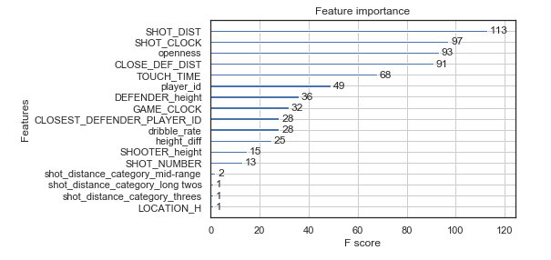

# NBA Shot Analysis

## Project aims

In this project I used the OSEMN system on an NBA shot attempts dataset from the 2014-2015 season. The aim of this project is to use this dataset to examine shot trends and player performance along with constructing various machine learning classifier models to identify the top features that indicate shot success.

## Methodology

The dataset used for this project consists of over 120,000 shot attempts, each associated with the following features:

- GAME_ID
- MATCHUP
- LOCATION (Home (H) or Away (A))
- GAME_RESULT (Win and Lose)
- FINAL_MARGIN
- SHOT_NUMBER
- PERIOD (Quarter/Overtime)
- GAME_CLOCK
- SHOT_CLOCK
- DRIBBLES
- TOUCH_TIME
- SHOT_DIST (ft)
- PTS_TYPE
- SHOT_RESULT
- CLOSEST_DEFENDER
- CLOSEST_DEFENDER_PLAYER_ID
- CLOSE_DEF_DIST
- FGM
- PTS
- player_name
- player_id
- SHOOTER_height (ft)
- DEFENDER_height (ft)

Various feature engineering was done to attempt to help the machine learning models be more accurate and to generate features that are more impactful towards the target variable. 

Then, before feature selection and machine learning was done, the data was explored to see who the top shooters and top defenders were.

## Results

Machine learning models such as XGBoost, Logistic Regression, and Random Forest, were built to try and predict whether a shot attempt was successful or not.  Also feature importance weights were observed from the XGBoost model to show that shot distance and shot clock were the top features used in the model.

Here are some of the charts that were built using matplotlib and seaborn to show the importance of shot distance as well as how shot distance effects shot efficiency with regards to 2-point and 3-point shots.

Based on the findings the best model ended up being XGBoost, which showed the most important features to be SHOT_DIST and SHOT_CLOCK, while CLOSE_DEF_DIST and openness also had some importance as well. The accuracy score ended up only beating the baseline model by 7%, probably not good enough to be used by any teams based on the dataset.

Despite the low accuracy score, the dataset provided interesting insight on the relationship between shot distance and the amount of shots made/missed. It also showed how the most efficient shots were around the basket at less than 8 feet and then three point shots at around 22 feet. The mid-range and long two shots showed to be the least efficient shots based on points per shot. 

With regards to shot clock, the data showed there were more makes than misses when there were about 18 seconds or more left on the clock showing that fast break points greatly influence makes. 

Further work that can be done in the future to improve upon these results include:
- More extensive GridSearch on models
- Incorporate more data from other seasons to compre trends and see if that helps accuracy

## Blog

The following link takes you to my blog where I explain more about this project. 

[Swish_or_Brick](https://medium.com/@sabatinochen/swish-or-brick-b12c72af1b)

